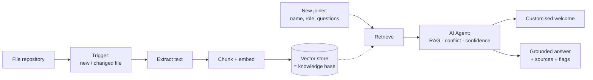

# OnboardIQ — Product Requirements Document

> **Product:** OnboardIQ · **Type:** MVP PRD · **Last updated:** 2026-09-21 · **Owner:** Debbie

---

## 1. Product overview

**Name:** OnboardIQ

**One-line description:** An AI onboarding assistant that turns a team's existing project files into instant, grounded answers and a personalised welcome — getting new joiners productive in minutes, not weeks.

**Product vision:** Every new team member should be effective from day one. The knowledge a joiner needs almost always already exists — it's just scattered across drives, docs, and chat, so people burn weeks asking around and leads answer the same questions on every project. OnboardIQ makes a team's own documentation self-serve, trustworthy, and conversational: new joiners get answers and a tailored welcome drawn from the team's real files, with sources and honest confidence, so existing knowledge stops being a bottleneck.

## 2. Problem

Onboarding a new team member takes weeks — not because the information is missing, but because it is scattered. New joiners don't know where files live, who is on the team and what they own, or when the next client demo is, so they interrupt busy colleagues and leads answer the same questions on every project.

The knowledge already exists: the team has a shared **file repository** (specs, meeting notes, checklists, PDFs). It just isn't self-serve. This is a retrieval-and-answer problem, not a content problem.

## 3. Goal

Get a new joiner productive in minutes, not weeks, by making the team's own knowledge self-serve and trustworthy. A new team member should be able to orient themselves, find what they need, and answer their own questions on day one — without interrupting colleagues — while leads trust that the answers are accurate and grounded in real documents.

## 4. Target users

**Primary — the new team member (days 1–5).**

- "Orient me" — what is this project and what's the current state?
- "Point me to things" — where are the files, tools, and who owns what?
- "Answer my specific question" — dates, ownership, status — without feeling like a burden.

**Secondary — the team lead / onboarding buddy.**

- Stop answering the same questions on every project, and trust the agent won't mislead the new joiner.

## 5. Core features

Essential functionality for the first version:

- **Files-only ingestion** — builds the knowledge base from the existing file repository, with no manual data entry.
- **Grounded conversational Q&A (RAG)** — answers a new joiner's questions from the team's documents.
- **Multi-document reasoning** — synthesises an answer across several files at once.
- **Conflict handling** — when documents disagree, shows both positions with their sources instead of silently picking one.
- **Customised welcome message** — a personalised day-one welcome covering the project, people, key dates, and where things live.
- **Grounded answers with citations and confidence** — every answer cites its sources and states confidence; if the answer isn't in the docs, it says so and suggests who to ask.
- **Human-in-the-loop escalation** — low-confidence or conflicting answers route to a named human, with feedback captured on every answer.

**First version includes:** one repository as the source; text-extractable files (md, txt, pdf, docx); the Q&A chat plus the welcome message; source citations, confidence, and conflict flags; a single team / project.

## 6. User flows

The key journeys the product supports:

1. **Build the knowledge base (setup).** Documents in the existing repository are ingested automatically — extracted, chunked, embedded, and stored in a vector store — and refreshed as files are added or changed.
2. **Generate a welcome (day one).** A new joiner submits their name and role and receives a tailored welcome grounded in the docs: what the project is, who's who, the next key dates, and where things live.
3. **Ask a question.** The joiner asks in chat; the system retrieves the most relevant passages and answers conversationally with sources and a confidence level, flagging any conflict between documents.
4. **Escalate to a human (HITL).** When an answer is low-confidence or documents conflict, the question and draft answer route to a named human (e.g. the lead), and the joiner is told it's been flagged.

The architecture behind these flows is in **§7.4 Platform requirements**.

## 7. Requirements

### 7.1 Functional requirements (acceptance criteria)

| # | Requirement | Done when… |
| --- | --- | --- |
| R1 | Files-only inputs | Dropping a file into the repository makes its content answerable — no manual data entry, no code change |
| R2 | RAG | Every answer is generated from retrieved passages and is traceable to a source; nothing is invented outside the docs |
| R3 | Multi-doc reasoning | A question whose answer spans two or more documents is answered completely |
| R4 | Conflict handling | Given two docs with contradictory facts (e.g. a demo date that moved), the agent flags the conflict and shows both positions with sources, tells the new joiner to verify with the owner, and never picks one or assumes which is current |
| R5 | Customised welcome | Given a name and role, it generates a welcome covering the project, key people, important dates, and where things live — grounded in the docs |
| R6 | Appropriate confidence | Each answer carries a confidence signal and cites sources; if the answer isn't in the docs it says so and suggests who to ask |
| R7 | Conversational | Answers read naturally, in the second person, and stay concise |

### 7.2 UX requirements

- Answers are warm, conversational, and in the second person, and stay concise (R7).
- Every answer surfaces its **source citations** and a **confidence level** (High / Medium / Low).
- On an ambiguous question, the assistant asks to clarify or lists what it found.
- When the answer isn't in the docs, it gives a clean fallback — says so and suggests who to ask — rather than guessing.

### 7.3 Performance requirements

- **Latency:** an answer completes in under 5 seconds; a welcome message under 10 seconds.
- **Cost per task:** within budget — target ~$0.10 per joiner — with token usage logged per task.
- **Grounding accuracy:** ≥ 90% of answer claims traceable to a source document.
- **Hallucination:** 0 fabrications; 100% correct refusal on out-of-scope questions.

### 7.4 Platform requirements

Built on **n8n**, with the existing file repository as the source. One knowledge base, two flows on top of it. Conflict handling and confidence live in the AI Agent's prompt, not in extra infrastructure — which keeps the MVP small. The welcome message reuses the same retrieval and agent with a different prompt.

**Maps to these n8n nodes:** `Google Drive` + `Drive / Schedule Trigger` → `Extract from File` → `Recursive Text Splitter` + `Embeddings` → `Vector Store` → `Chat / Form Trigger` → `AI Agent` + `Chat Model` + retriever tool → `Respond to Chat`.

**Human-in-the-loop is a requirement, not an add-on:** low-confidence or conflicting answers must escalate to a named human, feedback is captured on every answer, and the welcome message is human-approved before it's sent.

## 8. Success metrics

How we'll know the product is working:

| Metric | Target (to validate) | Why it matters |
| --- | --- | --- |
| Time to first useful answer | < 2 min from access | The core promise — minutes, not weeks |
| Self-serve rate | ≥ 70% of common questions answered without pinging a human | Removes the load from leads |
| Grounding / accuracy | ≥ 90% of answers correct and traceable to a source doc | Trust; measured on an eval set |
| Conflict recall | 100% of known doc conflicts flagged, not silently resolved | Wrong-but-confident is the worst outcome |
| New-joiner confidence | ≥ 4 / 5 on "I knew where to start" | The experience we're improving |

### 8.1 Validation & launch gate

Before launch, OnboardIQ must pass a fixed **golden eval set** covering every requirement (R1–R7) and meet the thresholds below. The set is re-run on any change to the prompt, model, chunking, top-K, or embeddings.

| What's validated | Threshold to pass |
| --- | --- |
| Requirement coverage (R1–R7) | 100% of must-pass cases (grounding, conflict, refusals, welcome, confidence) |
| Grounding accuracy | ≥ 90% of claims source-traceable |
| Conflict recall | 100% of conflicts flagged |
| Hallucination | 0 fabrications; 100% correct refusal on out-of-scope questions |
| Latency | answer completes < 5s (welcome < 10s) |
| Cost per task | within budget (~$0.10 per joiner target; logged per task) |
| Self-serve rate (pilot) | ≥ 70% |
| New-joiner CSAT (pilot) | ≥ 4 / 5 |

Also covered: the defined **edge cases** (empty KB, no-answer, ambiguity, prompt injection, scanned PDF, stale index, sensitive docs). Full methodology, the golden set, and the operational metrics (latency, hallucination, cost, HITL) live in the [Test & Evaluation Plan](https://claude.ai/code/artifact/3a91d255-19aa-4f4c-b864-c6e0cacf029f).

## 9. Out of scope

What should not be built yet:

- Writing back or taking actions (won't edit docs, tickets, or calendars)
- Per-document permissions
- Multi-project tenancy
- Voice
- An analytics dashboard
- Model fine-tuning

## Appendix — Risks & open questions

- **Version history looks like conflict.** An "old vs current" fact (a date that moved) may read as a contradiction. Decision (v1): flag-only. The agent shows both positions with their sources and tells the new joiner to verify with the owner; it makes no assumptions about which is current. A later version may add a recency/date signal to tell "moved" from "outdated."
- **Stale knowledge base** if the repository isn't the real source of truth. Open question: is the repo authoritative?
- **Retrieval quality on messy docs.** Mitigate with chunking + an eval set of real onboarding questions (including a seeded conflict).
- **Sensitive documents.** Some files may not be for every joiner — permissions are a v2 concern, flagged now.
